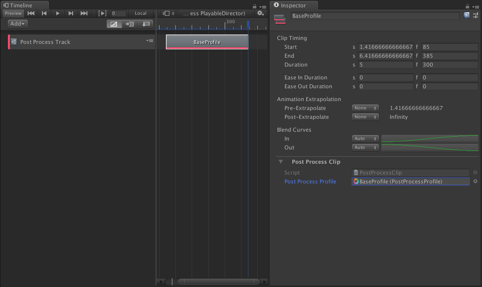

*__- Code and example scene available on [GitHub](https://github.com/spencersteers/unity-post-processing-playable) -__*

Over the summer I have been getting back into Unity development after being away from it for about 2 years or so. Since then a lot of new features have been added and I being someone who is a bit addicted to updates, patch notes, and changelogs I wanted to spend some time exploring a [Timeline](https://docs.unity3d.com/Manual/TimelineSection.html) and [Post-processing (v2)](https://github.com/Unity-Technologies/PostProcessing). 

My current Unity project uses a fair amount of Post-processing and I wanted a way to smoothly transition between effects. Extending Timeline seemed to be a great way to to accomplish this and would also integrate into the existing workflow my designer and I use to build cutscenes and other visual effects.

Unity has a few of blog posts about extending timeline and I strongly suggest checking them out as I won't be spending much time covering the anatomy of a timeline extension. I first got started with [Creative Scripting for Timeline](https://blogs.unity3d.com/2018/04/05/creative-scripting-for-timeline/) and most recently they have published [Extending Timeline: A Practical Guide](https://blogs.unity3d.com/2018/09/05/extending-timeline-a-practical-guide/). 

Before getting into the Timeline code it is worth covering how I am currently using post-processing. My solution is specific to my setup and does not support all the different ways post-processing can be used. But for simple projects like mine it works well.

## How I use Post-processing

Every scene has a single global _Post Process Volume_ and _Post Process Profile_ which I will refer to as the **Base Volume and Profile**. The base profile then contains every effect that will ever be active in a scene. During a cutscene, a separate volume and profile is setup to override certain parameters of the base volume. I will refer to this volume and profile as the **Override Volume and Profile**.

### Animating from Base to Override

When multiple global volumes are active in a scene the end result can be changed based on the volumes `weight` and `priority`. For example consider an animation where a [Vignette](https://github.com/Unity-Technologies/PostProcessing/wiki/Vignette) effect is intensified. Setup a base volume to have a `priority` of 0 and a `weight` of 1. Create an override volume with a `priority` of 1 and a `weight` of 0. The override profile then has the vignette `intensity` parameter configured to how it should look at the end of the animation.

 and Override Volume/Profile.")

When the `weight` of the override volume is changed from `0` to `1` the vignette `intensity` will smoothly interpolate from the base profile parameter to the override profile parameter. Given a base profile with a vignette intensity of `0.25` and an override profile with a vignette intensity of `0.5`, the final intensity will change from `0.25 -> 0.5` as the weight changes from `0 -> 1`.

<figure class="video-figure">
  <video controls>
    <source type="video/mp4" src="vignette-weight-override.mp4" />
  </video>
  <figcaption>Changing override volume weight to animate the vignette intensity.</figcaption>
</figure>

A limitation of this method is that only parameters that are enabled _(have a ☑)_ in both the base profile and override profile will change. This is why the base profile must contain every effect and parameter that you want present at the end.

This limitation results in the code being very simple because Timeline is built around animating a weight value from 0 to 1. Instead of translating the weight of a playable into some unique animation logic we can just pass the weight directly to a post process volume.

## Extending Timeline

_If you are unfamiliar with the anatomy of Timeline I suggest you read [Extending Timeline: A Practical Guide](https://blogs.unity3d.com/2018/09/05/extending-timeline-a-practical-guide/)._

For my purposes I decided to associate a _Post Process Profile_ asset with a clip instead of a _Post Process Volume_. Starting from the asset cuts out the need to first create and setup a volume. In my experience Unity tools become vastly simpler when they do not depend on a configured GameObject. The downside is that this means the playable behaviour is responsible for instantiating a _PostProcessVolume_ and cleaning up after itself.

For now my project can afford on demand GameObject instantiations but it is important to keep in mind that this sort of instantiation is a bad practice and is _terrible_ for performance.

### PostProcessClip and PostProcessBehaviour

The _PostProcessClip_ defines our data and will create the _PostProcessBehaviour_. When the clip creates the behaviour, it will instantiate a _PostProcessVolume_ that is configured to use the Profile associated to the clip.

```csharp
[Serializable]
public class PostProcessClip : PlayableAsset, ITimelineClipAsset
{
    [HideInInspector]
    public PostProcessBehaviour template = new PostProcessBehaviour();

    public PostProcessProfile postProcessProfile;
  
    public ClipCaps clipCaps
    {
        get { return ClipCaps.Extrapolation | ClipCaps.Blending; }
    }
  
    public override Playable CreatePlayable(PlayableGraph graph, GameObject owner)
    {
        var playable = ScriptPlayable<PostProcessBehaviour>.Create(graph, template);
        PostProcessBehaviour clone = playable.GetBehaviour();
        int layer = LayerMask.NameToLayer("PostProcess");
        if (postProcessProfile != null)
        {
            PostProcessVolume volume = PostProcessManager.instance.QuickVolume(
              layer, 
              1, 
              postProcessProfile.settings.ToArray()
            );

            volume.weight = 0;
            volume.priority = 1;
            volume.isGlobal = true;
            volume.profile = clone.postProcessProfile;
            clone.postProcessVolume = volume;
        }

        return playable;
    }
}
```

The [QuickVolume](https://github.com/Unity-Technologies/PostProcessing/wiki/Manipulating-the-Stack#quick-volumes) method will instantiate a new _GameObject_ and _PostProcessingVolume_ that uses the Profile assigned to the clip. The volume is then configured with to be global with a priority of 1 and is then passed to the newly created `PostProcessBehaviour`.

`QuickVolume` creates a hidden object and for debugging purposes it can be helpful to have that object shown in the hierarchy:

```csharp
PostProcessVolume volume = PostProcessManager.instance.QuickVolume(...);
volume.gameObject.hideFlags = HideFlags.DontSave | HideFlags.NotEditable;
volume.gameObject.name = $"PostProcessClip.CreatePlayable: Quick Volume [Profile {postProcessProfile.name}]";
...
```

This playable supports mixing and blending clips so the logic for changing volume weight will be inside _PostProcessMixerBehaviour_. The _PostProcessBehaviour_ just needs to contain a reference to the volume it controls and logic for cleaning up the GameObject after the playable is no longer needed.

```csharp
[Serializable]
public class PostProcessBehaviour : PlayableBehaviour
{
    public PostProcessVolume postProcessVolume;

    public override void OnPlayableDestroy(Playable playable)
    {
        if (postProcessVolume != null)
        {
            GameObject go = postProcessVolume.gameObject;
            RuntimeUtilities.DestroyVolume(postProcessVolume, false);
            RuntimeUtilities.Destroy(go);
        }
    }
}
```



### PostProcessTrack

The _PostProcessTrack_ just needs to create the _PostProcessMixerBehaviour_.

```csharp
[TrackColor(0.98f, 0.27f, 0.42f)]
[TrackClipType(typeof(PostProcessClip))]
public class PostProcessTrack : TrackAsset
{
    public override Playable CreateTrackMixer(PlayableGraph graph, GameObject go, int inputCount)
    {
        var scriptPlayable = ScriptPlayable<PostProcessMixerBehaviour>.Create(graph, inputCount);
        return scriptPlayable;
    }
}
```

### PostProcessMixerBehaviour

_PostProcessMixerBehaviour_ has the method `ProcessFrame` which will set the volume `weight` depending on where we are in the timeline.

```csharp
public override void ProcessFrame(Playable playable, FrameData info, object playerData)
{
    int inputCount = playable.GetInputCount();
    for (int i = 0; i < inputCount; i++)
    {
        ScriptPlayable<PostProcessBehaviour> playableInput = (ScriptPlayable<PostProcessBehaviour>)playable.GetInput(i);
        PostProcessBehaviour input = playableInput.GetBehaviour();

        float inputWeight = playable.GetInputWeight(i);
        input.postProcessVolume.weight = inputWeight;
   }
}
```

Currently `playable.GetInputWeight(i)` will return `0` for clips that are not being played and `1` for clips that are being played. Because the clip supports `ClipCaps.Blending` the clip _Ease In Duration_ and _Ease Out Duration_ can be set so that the weight will ease from `0 -> 1` over a specified time.

<figure class="video-figure">
  <video controls>
    <source type="video/mp4" src="post-process-clip-with-easing.mp4" />
  </video>
  <figcaption>5s clip with 1s ease in and 1s ease out.</figcaption>
</figure>


## Wrapping Up

In all this is a pretty simple and easy to use way to control Post-processing effects with Timeline. It is pretty limited in that it only works with global volumes but for simple projects I think it works great and best of all it is a small amount of code.

After spending more time with it I have added the ability to set a custom [AnimationCurve](https://docs.unity3d.com/ScriptReference/AnimationCurve.html) for controlling the weight instead of just using _Ease In Duration_ and _Ease Out Duration_. Be sure to checkout the [repo](https://github.com/spencersteers/unity-post-processing-playable) for all the code, updates I have made, and an example project!
